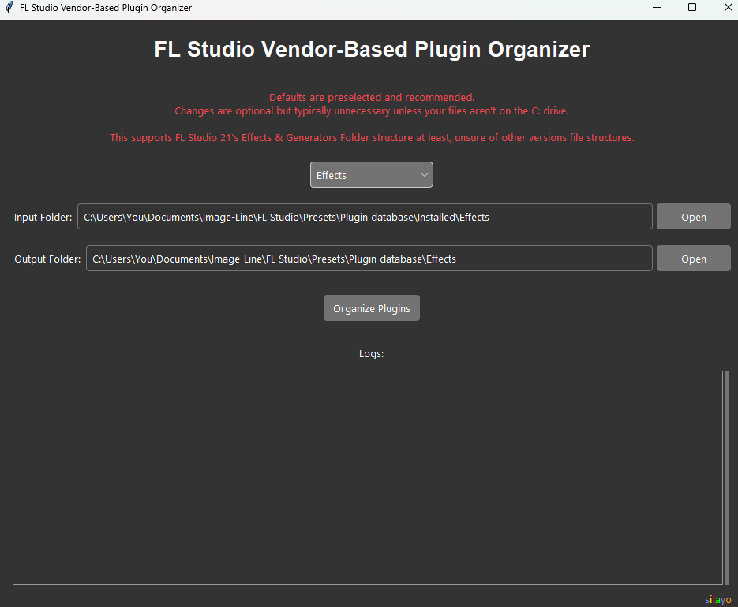
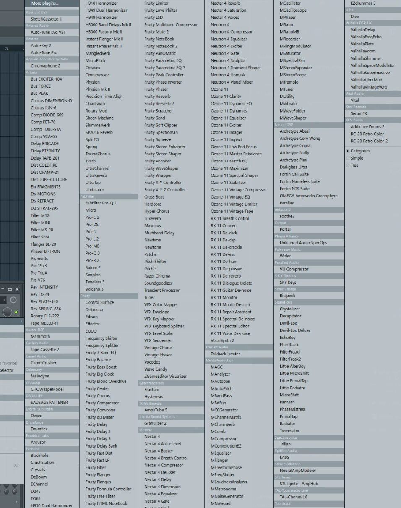

# FL Studio Vendor-Based Plugin Organizer

**FL Studio Vendor-Based Plugin Organizer** is a tool designed to help streamline the organization of your FL Studio plugins by automatically sorting them into vendor-specific folders. This makes it easier to manage and access your plugins, improving workflow and efficiency within FL Studio.

**No coding or technical knowledge is required**—this tool comes as a simple, easy-to-use executable file for Windows, so you can get started quickly without any hassle. It's built specifically for Windows users to enhance their plugin management experience.

---

## Graphical User Interface

  

---

## Features

- **User-Friendly GUI**: Simple and intuitive interface for easy folder selection.
- **Automatic Plugin Organization**: Automatically sorts plugins into vendor folders based on your selected input and output directories.
- **Supports Both Effects and Generators**: Works with FL Studio's **Effects** and **Generators** folder structures.
- **Log Output**: Provides a log output to monitor the organization process and track any errors.

---

## Example of Plugins List After Running

  

---

## Installation

### Prerequisites
- Windows OS
- Ensure you have [FL Studio 21](https://www.image-line.com/) installed on your system.

### Downloading the Application
1. Download the latest release from the [Releases](https://github.com/steven-coll/FL-Studio-Vendor-Based-Plugin-Organizer/releases/tag/1.0.0) section of the repository.
2. Extract the contents of the zip file to your preferred location on your computer.

---

## Running the Application
**
1. Locate the <picture></picture>`FL Studio Vendor Organizer.exe` file in the extracted folder.**
2. Double-click the executable to launch the application.
3. The application should open without requiring any additional dependencies or configurations.

---

## Usage

1. **Select Input and Output Folders**: The application defaults to recommended paths for your FL Studio Effects and Generators. You can change these paths if necessary.
2. **Start the Organization Process**: Click the **Organize Plugins** button to begin sorting your plugins.
3. **Monitor Logs**: The application provides log output in the GUI, allowing you to see the progress and any errors encountered during the process.

---

## Warning

The **output folder** will be overwritten during the plugin organization process, which means any existing files or folders in the output directory will be deleted. This shouldn't affect your FL Studio setup unless you have manually modified or customized files in the output folder.

---

## Folder Structure

The application supports the following folder structure:

### Input Folder:
- Should be from the `\Plugin database\Installed\` folder
  - For Effects: `C:\Users\{YourUsername}\Documents\Image-Line\FL Studio\Presets\Plugin database\Installed\Effects`
  - For Generators: `C:\Users\{YourUsername}\Documents\Image-Line\FL Studio\Presets\Plugin database\Installed\Generators`

### Output Folder:
- Should be from the `\Plugin database\` folder
  - For Effects: `C:\Users\{YourUsername}\Documents\Image-Line\FL Studio\Presets\Plugin database\Effects`
  - For Generators: `C:\Users\{YourUsername}\Documents\Image-Line\FL Studio\Presets\Plugin database\Generators`

---

## Notes

- The application is designed to work with FL Studio 21 but may function with earlier versions.
- If your plugin files are located on a different drive, you can change the input and output folder paths using the provided GUI options.
